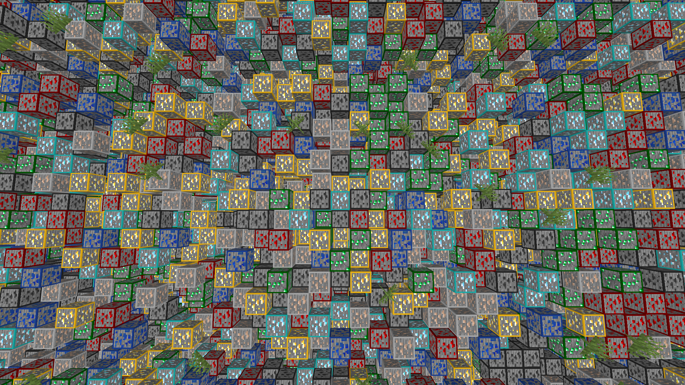

# ActualAntiXRay

This is an actual AntiXRay plugin for PocketMine-MP.

Unlike other so-called "AntiXRay" plugins, this one does not simply inform staff members if an ore is broken.
This plugin modifies the chunk packet sent to the client to make it look like a chunk contains a ridiculous amount of ores.


## Auto-update

On every startup the plugin asks the GitHub API for the newest release of
[ColinHDevNew/ActualAntiXRay-PM5](https://github.com/ColinHDevNew/ActualAntiXRay-PM5/releases). If that release is
newer than the running version and ships a `.phar` asset, the file is downloaded into
`plugin_data/ActualAntiXRay/updates/` while the server is running, and installed when the server stops: the new file
takes the place of the running `.phar`, which deletes itself. No leftovers, no second copy of the plugin in
`plugins/`, and the file name stays the same.

Everything happens in an async task, so an unreachable or slow GitHub never holds up the server. The download is only
accepted once it opens as a valid `.phar` (which verifies its signature) whose `plugin.yml` names this plugin with a
higher version, and the running file is only deleted after a copy of the update sits next to it — a failure at any
point therefore leaves a working plugin behind and is retried on the next stop. Because no logger is alive anymore
when the swap happens, its outcome is written to `plugin_data/ActualAntiXRay/update.log` and printed on the next start.

The behaviour is configured in `config.yml`:

```yaml
auto-update:
  enabled: true            # check for a newer release at all
  download: true           # false: only report that an update exists
  repository: "ColinHDevNew/ActualAntiXRay-PM5"
  pre-releases: false      # whether pre-releases count as updates
  token: ""                # optional, raises GitHub's 60 requests/hour per IP
```

A plugin running from a source folder (DevTools) is converted on the way: the update is written as
`plugins/ActualAntiXRay.phar` and the source folder is then **deleted**, so the next start loads the `.phar`. The
folder only goes once the `.phar` is in place (a server that found both would load the plugin twice), and only after
its `plugin.yml` confirms it is this plugin's folder. Keep your working copy somewhere other than `plugins/` if you
develop on it, or set `download: false`.

## Compatibility

This version targets **PocketMine-MP 5.44.x** (BedrockProtocol 58, Minecraft: Bedrock Edition 1.26.30)
and also runs on **Altay 5.44.x** (BedrockProtocol 60). The two protocol libraries disagree on the
signature of `LevelChunkPacket::create()`, which is detected once per worker thread at runtime.

Instead of reimplementing `Player::requestChunks()`, the plugin now registers its own
`AntiXRayChunkCache` in PocketMine's chunk cache registry, so the server asks it for chunk payloads
on its own. That keeps the plugin far less sensitive to changes in PocketMine's chunk sending code.
